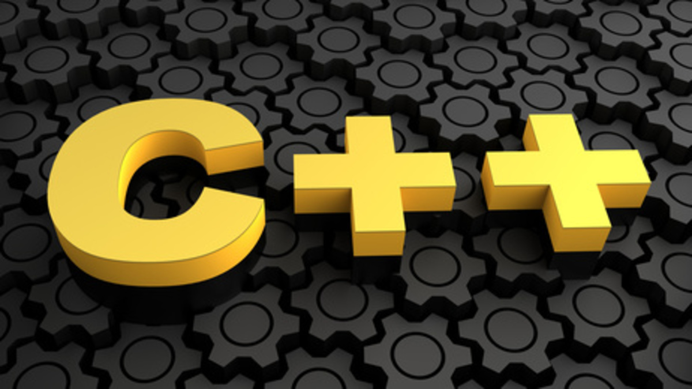

# 🚀 My C++ Odyssey



> *"C makes it easy to shoot yourself in the foot; C++ makes it harder, but when you do, it blows your whole leg off."* - Bjarne Stroustrup

## 🧭 The Journey

Welcome to my C++ adventure! This repository documents my journey through the vast universe of C++, from fundamental concepts to advanced techniques. Each module represents a new challenge tackled, a new skill mastered, and occasionally, a new gray hair earned.

As a student at **1337 (42 Network)**, my approach goes beyond just passing exercises—I strive to deeply understand the power and flexibility of C++. This journey has been filled with late-night debugging sessions, countless "why isn't this working?!" moments, and the occasional victory dance when conquering a particularly stubborn bug.

## 📚 Module Breakdown

Each module progressively builds on C++ fundamentals, introducing increasingly complex topics:

### **Module 00: The Basics**
- Introduction to C++
- Namespaces, classes, member functions, and I/O streams
- Implemented a simple **phonebook application** using classes

### **Module 01: Memory and References**
- Dynamic memory allocation, pointers, references
- Switch statements, file streams
- Built programs demonstrating **memory management techniques**

### **Module 02: Ad-hoc Polymorphism**
- Operator overloading
- Orthodox Canonical Form (OCF)
- Created a **fixed-point number class** from scratch

### **Module 03: Inheritance**
- Class inheritance
- Implemented a **virtual world with character classes**

### **Module 04: Subtype Polymorphism**
- Abstract classes and interfaces
- Deep dive into polymorphism
- Designed a **combat simulation system**

### **Module 05: Exceptions**
- Try/Catch blocks
- Exception handling
- Developed **robust error-handling systems**

### **Module 06: C++ Casts**
- Static, dynamic, reinterpret, and const casts
- Type conversion techniques
- Implemented programs demonstrating **various casting methods**

### **Module 07: Templates**
- Function and class templates
- Created **generic containers and algorithms**

### **Module 08: Templated Containers**
- Standard Template Library (STL) containers
- Worked with **vectors, lists, and maps** to solve complex problems
- Built **custom container adaptors**

### **Module 09: STL**
- Harnessed the full power of STL
- Implemented a **Bitcoin exchange system**
- Developed an **RPN calculator** and **merge-sort program**

## 💡 Key Learnings

Throughout this journey, I’ve realized:
- C++ is both **frustrating** and **rewarding**
- There are always at least **three ways** to solve a problem
- **Memory management** isn’t just important—it’s an **art form**
- Templated programming is powerful but can make error messages **longer than The Lord of the Rings**
- Writing **clean, maintainable code** isn’t just a best practice—it’s a survival strategy

## 🛠️ Building & Testing

Each module includes a `Makefile` for easy compilation:

```bash
cd [module_directory]
make
```

To run a specific exercise:

```bash
./[executable_name] [arguments]
```

## 🎯 What’s Next?

This repository is more than just a collection of exercises—it's the **foundation** of my C++ expertise. Moving forward, I aim to apply these concepts to **real-world projects**, **performance-critical systems**, and **contribute to open-source C++ projects**.

If you're on a similar journey, remember: **frustration is part of the process.** But that *Eureka!* moment when everything clicks makes it all worthwhile!

## 📬 Get in Touch

Have questions about my implementations? Want to share your own C++ experiences? Let’s connect!

- **LinkedIn:** [Mehdi Serghini](https://www.linkedin.com/in/mehdi-serghini-a81160245/)
- **Email:** [mehdi_serghini@yahoo.com](mailto:mehdi_serghini@yahoo.com)
- **42 Profile:** [meserghi](https://profile.intra.42.fr/users/meserghi)

Happy coding! 💻

